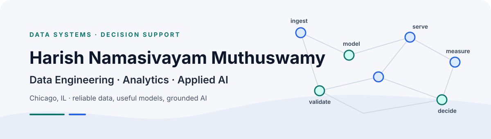

  <picture>
    <source media="(prefers-color-scheme: dark)" srcset="./assets/header-dark.svg">
    <source media="(prefers-color-scheme: light)" srcset="./assets/header-light.svg">
    
  </picture>

  
  
  
  

I build reliable data platforms, analytics products, machine-learning workflows, and grounded AI applications that turn messy operational data into decisions people can use.

**Chicago, IL**  ·  **M.S. Data Science — Illinois Institute of Technology**

<picture>
  <source media="(prefers-color-scheme: dark)" srcset="./assets/divider-dark.svg">
  <source media="(prefers-color-scheme: light)" srcset="./assets/divider-light.svg">
  
</picture>

## Impact

- Built and maintained SQL-based ETL workflows for a KYC compliance platform processing **1M+ onboarding records**; query and indexing improvements increased ETL performance by approximately **40%**.
- Automated recurring reporting with **30+ SQL queries across three databases**, reducing manual reporting effort by approximately **25%**, and reconciled **50K+ customer records** at approximately **98% accuracy**.
- At U-Sense.IT, analyzed **2,000+ automotive sensor records**, identified **15+ data-quality issues**, and engineered **10+ tolerance-margin features** for vehicle-level risk scoring.
- RetailIQ turns **100,000 synthetic retail transaction lines** into validated, modeled, and KPI-ready data through Python, Snowflake, dbt, Airflow, and Power BI.
- PartsFlow's synthetic backtest reports **19.14% WAPE vs. 21.55% seasonal-naive**, with **30 of 40 SKUs** beating the baseline; the result is explicitly a simulation, not a production claim.

## Experience snapshot

**U-Sense.IT srl — Data Analytics & Algorithms Intern** · Mar–May 2026  
Data-quality analysis, vehicle risk scoring, predictive modeling, and real-time Grafana monitoring across two manufacturing stages.

**Wipro Technologies Ltd. — Project Engineer** · Dec 2022–Jul 2024  
SQL ETL, data validation and reconciliation, stored procedures, query optimization, and Power BI reporting for a US banking KYC compliance platform.

## Featured projects

| Project | What I built | Proof and access |
| --- | --- | --- |
| [**RetailIQ**](https://github.com/HarishNamasivayamM/RetailIQ-retail-data-platform) | A layered retail analytics platform: Python validation → Snowflake raw layer → dbt models → Airflow orchestration → Power BI semantic-model handoff. | **100K synthetic transactions**, 2K customers, 27 products, 8 stores, 10 KPI definitions. Python · SQL · dbt · Snowflake · Airflow · Power BI |
| [**FinDocs RAG**](https://github.com/HarishNamasivayamM/FinDocs-RAG) · [demo](https://findocs-rag-krn9voqbd3yqedahdza3ch.streamlit.app/) | Source-aware financial document intelligence with page-preserving ingestion, hybrid semantic + BM25 retrieval, metadata filters, citation validation, and retrieval evaluation. | **19-document public corpus** with offline mode, FAISS, LangChain, Streamlit, Pydantic, pytest, and security documentation. |
| [**ChurnShield**](https://github.com/HarishNamasivayamM/ChurnShield) | A reproducible churn workflow that supports validation, Random Forest training, batch scoring, Kafka event scoring, Snowflake handoff, and Power BI-ready outputs. | **7K+ customer records** in the supplied project material. Python · scikit-learn · Kafka · Snowflake · Docker · GitHub Actions |
| [**PartsFlow**](https://github.com/HarishNamasivayamM/PartsFlow) | A demand-forecasting and replenishment engine that connects SKU-level forecasts to safety stock, reorder points, policy simulation, and planner worklists. | Synthetic **40-SKU / 12-dealer** network; **19.14% WAPE** and **89.39% simulated fill rate**. Python · DuckDB · statsmodels · Streamlit |
| [**CampusGuide RAG**](https://github.com/HarishNamasivayamM/CampusGuide-RAG-Grounded-Institutional-Knowledge-Assistant) · [demo](https://campusguide-rag-grounded-institutional-knowledge-assistant-c4v.streamlit.app/) | A multi-domain institutional assistant routing questions across policies, tuition, calendar, and contacts, then combining structured search, hybrid retrieval, reranking, and grounded response generation. | Deployed Streamlit demo plus CLI, FastAPI, Elasticsearch, local search, embeddings, and clarification handling. |
| [**CTA TransitPulse**](https://github.com/HarishNamasivayamM/cta-transitpulse) · [demo](https://cta-transitpulse-m2nssudw6zppycqfwjega2.streamlit.app/) | A Chicago transit analytics workflow that models raw observations and predictions in SQLite and exposes route KPIs, reliability trends, heatmaps, maps, and CSV exports. | **17K+ vehicle observations**, **69K+ predictions**, **14 routes**, and 10 reusable SQL analyses. Python · SQL · Pandas · SQLite · Streamlit · Plotly |

### More work

[RideCast](https://github.com/HarishNamasivayamM/RideCast-Divvy-Bike-Demand-Forecasting) — reproducible R/SARIMA demand forecasting with a **13.62% fixed-holdout MAPE**.  
[Crypto Tweet Impact](https://github.com/HarishNamasivayamM/crypto-tweet-impact) — an observational R/Python analysis of crypto-related posts and BTC/DOGE returns with a [public research site](https://crypto-tweet-impact-analysis.harishnamasivayam-m.chatgpt.site/); it treats the findings as association, not causation.  
[Bandaid Maps](https://github.com/HarishNamasivayamM/bandaid-maps) — an AI-assisted healthcare navigation application and **Melissa Data Challenge winner at LA Hacks 2025**.

## Technical stack

### Languages

  

### Data engineering and platforms

      

### Analytics and BI

   

### Machine learning and applied AI

    

### Engineering and delivery

   

## Certifications

- [**Microsoft Fabric Data Engineer Associate (DP-700)**](https://learn.microsoft.com/api/credentials/share/en-us/HarishNamasivayamMuthuswamy-8878/1875FA6C12BD2DBA?sharingId=48FEA08B143E048B) · Microsoft · earned Sep 2026
- [**Google Cloud Associate Cloud Engineer**](https://www.credly.com/badges/3299bee9-5f7e-4a1c-9070-7bb34c035f96/public_url) · Google Cloud · earned May 2023

## Education

**Illinois Institute of Technology** · Master of Data Science · Chicago, IL  
**Anna University** · Bachelor of Engineering, Electronics and Communication Engineering · Chennai, India

<picture>
  <source media="(prefers-color-scheme: dark)" srcset="./assets/divider-dark.svg">
  <source media="(prefers-color-scheme: light)" srcset="./assets/divider-light.svg">
  
</picture>

## Let’s connect

I’m open to opportunities across data engineering, analytics, cloud data platforms, machine learning, and applied AI.

  
  
  

