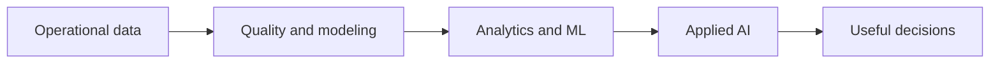

# Harish Namasivayam Muthuswamy

**Data Engineering | Analytics | Applied AI** 
Chicago, IL | M.S. Data Science, Illinois Institute of Technology

[Portfolio](https://harishmuthuswamy.com/) | [LinkedIn](https://www.linkedin.com/in/harish-namasivayam-muthuswamy/) | [Email](mailto:harishnamasivayam@gmail.com) | [Resume](https://harishmuthuswamy.com/resume.pdf)

I build reliable data platforms, analytics systems, machine learning workflows, and grounded AI applications that turn operational data into decisions people can use.

## What I do

| Data platforms | Analytics | Applied AI and ML |
| --- | --- | --- |
| Batch and streaming pipelines, ETL and ELT, data quality, dimensional modeling, warehouses, and lakehouses. | SQL, KPI design, metric layers, reconciliation, BI reporting, operational dashboards, and root cause analysis. | RAG, hybrid retrieval, embeddings, LLM workflows, predictive modeling, forecasting, risk scoring, and evaluation. |

## Evidence of impact

- **Enterprise data work:** Built and maintained SQL ETL workflows for a KYC compliance platform processing **1M+ onboarding records**. Query and indexing improvements increased ETL performance by approximately **40%**.
- **Reporting automation:** Automated recurring reporting with **30+ SQL queries across three databases**, reducing manual reporting effort by approximately **25%**, and reconciled **50K+ customer records** at approximately **98% accuracy**.
- **Manufacturing analytics:** At U-Sense.IT, analyzed **2,000+ automotive sensor records**, identified **15+ data quality issues**, and engineered **10+ tolerance margin features** for vehicle level risk scoring.
- **Decision systems:** PartsFlow's synthetic backtest reports **19.14% WAPE versus 21.55% seasonal naive**, with **30 of 40 SKUs** beating the baseline. The result is clearly labeled as a simulation.

## Selected work

### RetailIQ | Retail data platform and revenue analytics

**Data Engineering | Analytics** 
[Repository](https://github.com/HarishNamasivayamM/RetailIQ-retail-data-platform)

Designed a layered retail workflow from Python validation to Snowflake raw data, dbt transformations, Airflow orchestration, and a Power BI semantic model. The deterministic baseline contains **100,000 synthetic transaction lines**, 2,000 customers, 27 products, 8 stores, and 10 KPI definitions.

`Python` `SQL` `Snowflake` `dbt` `Airflow` `Power BI` `Data quality`

### FinDocs RAG | Financial document intelligence

**Applied AI | Information Retrieval** 
[Repository](https://github.com/HarishNamasivayamM/FinDocs-RAG) | [Live demo](https://findocs-rag-krn9voqbd3yqedahdza3ch.streamlit.app/)

Built source aware document Q&A with page preserving ingestion, metadata filters, hybrid semantic and BM25 retrieval, citation validation, offline mode, and retrieval evaluation. The checked in public corpus contains **19 documents**.

`Python` `LangChain` `FAISS` `BM25` `Pydantic` `Streamlit` `pytest`

### ChurnShield | Customer churn prediction pipeline

**Data Engineering | Machine Learning** 
[Repository](https://github.com/HarishNamasivayamM/ChurnShield)

Built a reproducible workflow for validation, Random Forest training, batch scoring, Kafka event scoring, Snowflake handoff, and Power BI ready outputs. The supplied project material covers **7K+ customer records**.

`Python` `scikit-learn` `Kafka` `Snowflake` `Docker` `GitHub Actions`

### PartsFlow | Forecasting and replenishment

**Forecasting | Decision Support** 
[Repository](https://github.com/HarishNamasivayamM/PartsFlow)

Connected SKU level demand forecasts to safety stock, reorder points, policy simulation, and planner worklists. The synthetic network covers **40 SKUs and 12 dealers**, with a simulated fill rate of **89.39% versus 82.36%** for the baseline policy.

`Python` `DuckDB` `statsmodels` `Holt Winters` `Streamlit` `Inventory analytics`

### CampusGuide RAG | Institutional knowledge assistant

**Applied AI | Search Systems** 
[Repository](https://github.com/HarishNamasivayamM/CampusGuide-RAG-Grounded-Institutional-Knowledge-Assistant) | [Live demo](https://campusguide-rag-grounded-institutional-knowledge-assistant-c4v.streamlit.app/)

Built a multi domain assistant for policies, tuition, calendar, and contacts. It combines query routing, structured search, hybrid retrieval, reranking, clarification handling, and grounded response generation.

`Python` `Elasticsearch` `Vector search` `Embeddings` `FastAPI` `Streamlit`

### CTA TransitPulse | Operational transit analytics

**Analytics Engineering | BI** 
[Repository](https://github.com/HarishNamasivayamM/cta-transitpulse) | [Live demo](https://cta-transitpulse-m2nssudw6zppycqfwjega2.streamlit.app/)

Modeled vehicle observations and arrival predictions in SQLite and built an interactive dashboard for route KPIs, reliability trends, heatmaps, maps, and CSV exports. The included demo profile covers **17K+ vehicle observations**, **69K+ predictions**, and **14 routes**.

`Python` `SQL` `Pandas` `SQLite` `Streamlit` `Plotly`

## Other work

- [RideCast](https://github.com/HarishNamasivayamM/RideCast-Divvy-Bike-Demand-Forecasting) - Reproducible R and SARIMA demand forecasting with a **13.62% fixed holdout MAPE**.
- [Crypto Tweet Impact](https://github.com/HarishNamasivayamM/crypto-tweet-impact) - An observational R and Python analysis of crypto related posts and BTC and DOGE returns, with a [public research site](https://crypto-tweet-impact-analysis.harishnamasivayam-m.chatgpt.site/). The project treats the findings as association, not causation.
- [Bandaid Maps](https://github.com/HarishNamasivayamM/bandaid-maps) - An AI assisted healthcare navigation application and Melissa Data Challenge winner at LA Hacks 2025.

## Professional experience

**U-Sense.IT srl - Data Analytics and Algorithms Intern** 
Mar 2026 - May 2026 | Data quality analysis, vehicle risk scoring, predictive modeling, and real time Grafana monitoring across two manufacturing stages.

**Wipro Technologies Ltd. - Project Engineer** 
Dec 2022 - Jul 2024 | SQL ETL, validation, reconciliation, stored procedures, query optimization, and Power BI reporting for a US banking KYC compliance platform.

## Technical toolkit

| Area | Tools and methods |
| --- | --- |
| Languages | `Python` `SQL` `R` |
| Data engineering | `PySpark` `Kafka` `Airflow` `dbt` `Snowflake` `Microsoft Fabric` `Azure` `ETL` `ELT` `Dimensional modeling` |
| Analytics and BI | `Power BI` `Streamlit` `Plotly` `Tableau` `KPI design` `Reconciliation` `Root cause analysis` |
| Machine learning | `scikit-learn` `XGBoost` `Random Forest` `Forecasting` `Feature engineering` `Model evaluation` `Risk scoring` |
| Applied AI | `RAG` `LangChain` `FAISS` `BM25` `Embeddings` `OpenAI API` `LLM evaluation` |
| Delivery | `Git` `Docker` `GitHub Actions` `pytest` `CI` `MLOps` |

## Certifications and education

- [Microsoft Fabric Data Engineer Associate, DP-700](https://learn.microsoft.com/api/credentials/share/en-us/HarishNamasivayamMuthuswamy-8878/1875FA6C12BD2DBA?sharingId=48FEA08B143E048B) - Microsoft - earned Sep 2026
- [Google Cloud Associate Cloud Engineer](https://www.credly.com/badges/3299bee9-5f7e-4a1c-9070-7bb34c035f96/public_url) - Google Cloud - earned May 2023
- **Master of Data Science** - Illinois Institute of Technology, Chicago, IL
- **Bachelor of Engineering, Electronics and Communication Engineering** - Anna University, Chennai, India

## Connect

Open to opportunities across data engineering, analytics, cloud data platforms, machine learning, and applied AI.

[Portfolio](https://harishmuthuswamy.com/) | [LinkedIn](https://www.linkedin.com/in/harish-namasivayam-muthuswamy/) | [Email](mailto:harishnamasivayam@gmail.com) | [Resume](https://harishmuthuswamy.com/resume.pdf)
